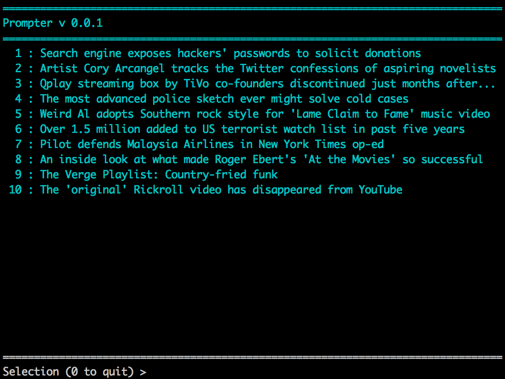

prompter
========
Command Line RSS reader - v 0.0.1

Provide RSS URL as only argument. Defaults to RSS feed from theverge.com. Coming features include color output, live updating.

Usage
===

prompter {OPTION}

-a --all:
	Fetch results regardless of whether or not the feed has been updated since last fetch

-s --silent:
	Only update, do not output results
	
-n --nocolor:
	Display articles without color
	
-d --display:
	Display only the specified number of articles
	
-o --offline:
	Do not update article contents
	
-f --feed:
	URL feed to use, defaults to previous URL
	
-h --help:
	Display this menu

-v --version:
	Display current version number
	
Requirements
===
- OS : Linux, OS X
- Dependencies : libxml2, libcurl, ncurses (All installed by default on majority of systems)

